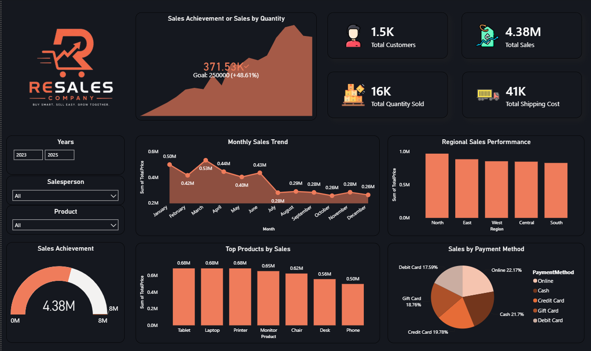

<div align="center">

# 📊 RESALES COMPANY
## 🚀 Sales Performance Dashboard


</div>

---

# 📌 About Project

This project is a complete **Sales Performance Dashboard** developed using **Power BI**, **MySQL**, and **Python**.

The dashboard converts raw sales data into meaningful business insights using KPIs, charts, DAX measures, SQL queries, and interactive filters.

---

# 🎯 Objectives

- Analyze sales performance
- Compare regional sales
- Track monthly trends
- Identify top-selling products
- Monitor customer behavior
- Analyze payment methods
- Measure sales achievement
- Support business decisions using data

---

# 🛠️ Technologies Used

| Tool | Purpose |
|------|----------|
| Power BI | Dashboard & Visualization |
| MySQL | Data Storage & SQL Queries |
| Python | Data Cleaning |
| Pandas | Data Analysis |
| Matplotlib | Data Visualization |
| CSV Dataset | Sales Data |

---

# 📂 Dataset Columns

- Order ID
- Product
- Region
- Customer Name
- Quantity
- Unit Price
- Total Price
- Store Location
- Payment Method
- Shipping Cost
- Salesperson
- Discount
- Order Date
- Delivery Date
- Region Manager

---

# 📊 Dashboard KPIs

✅ Total Sales

✅ Total Customers

✅ Total Orders

✅ Total Quantity Sold

✅ Sales Achievement

✅ Average Delivery Days

✅ Shipping Cost

---

# 📈 Dashboard Visuals

- 📊 Monthly Sales Trend
- 📍 Regional Sales Performance
- 🛒 Top Products by Sales
- 💳 Payment Method Analysis
- 🎯 Sales Achievement Gauge
- 📦 Sales Summary
- 🎛 Interactive Filters

---

# 🗄️ MySQL Queries

The project includes SQL analysis such as:

- Total Sales
- Region-wise Sales
- Top Products
- Store Performance
- Customer Analysis
- Payment Method Analysis
- Shipping Cost Analysis

---

# 🐍 Python Analysis

Python was used for:

- Data Cleaning
- Missing Value Detection
- Duplicate Removal
- Data Visualization
- Exploratory Data Analysis (EDA)

Libraries:

```python
pandas
matplotlib
numpy
```

---

# 📷 Dashboard Preview

> Replace with your screenshot.

```text
project.png
```

or

```markdown

```

---

# 📁 Project Structure

```
RESALES-Sales-Dashboard
│
├── Dashboard.pbix
├── Product-Sales-Region.csv
├── Sales.sql
├── Project.ipynb
├── Dashboard.png
├── README.md
└── LICENSE
```

---

# ✨ Features

✔ Interactive Dashboard

✔ Professional UI

✔ Custom Color Theme

✔ Dynamic KPIs

✔ DAX Measures

✔ SQL Analysis

✔ Python Data Cleaning

✔ Business Insights

---

# 📚 What I Learned

- Power BI Dashboard Development
- Data Cleaning
- Data Modeling
- DAX Measures
- SQL Queries
- KPI Design
- Dashboard UI Design
- Business Intelligence
- Data Storytelling

---

# 🚀 Future Improvements

- Real-Time Dashboard
- SQL Server Integration
- Power BI Service Deployment
- Forecasting
- AI Visuals
- Mobile Dashboard

---

---

# 👨‍💻 Author

<div align="center">

## Lucky Chaurasiya

🎓 **BCA (AIDA) Student**  
🏫 **LNCT University, Bhopal**

### 📬 Connect with Me

[](https://github.com/chaurasiyalucky241)

[](https://www.linkedin.com/in/lucky-chaurasiya-97946336b)

</div>

---

<div align="center">

### ⭐ If you found this project helpful, please give it a Star!


</div>
